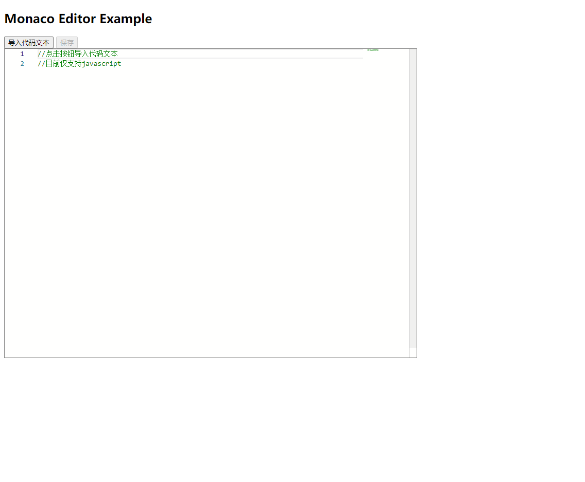

# monaco-editor Example

## How to use

    git clone https://github.com/wow577/geekbang.git
    cd homework2
    npm install
    npm run server
    //server is listening on 5500

Then visit [http://localhost:5500/browser-editor.html](http://localhost:5500/browser-editor.html)

## Related Knowledge

- monaco-editor
- FileReader
- window.showOpenFilePicker
- window.showSaveFilePicker

## Effect Picture

